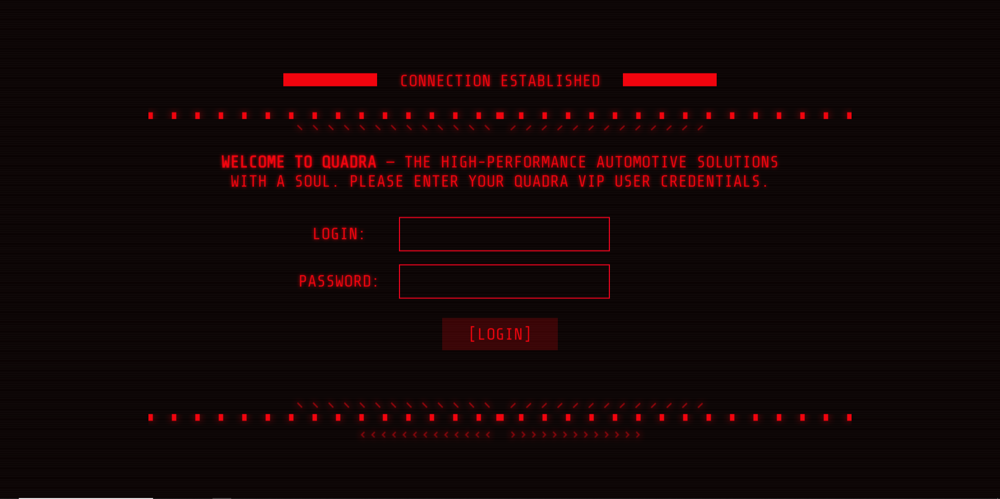
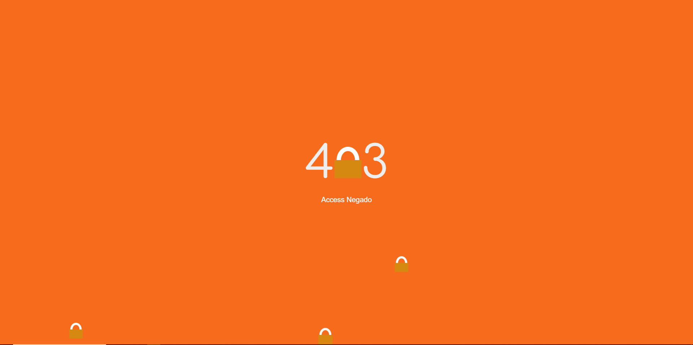
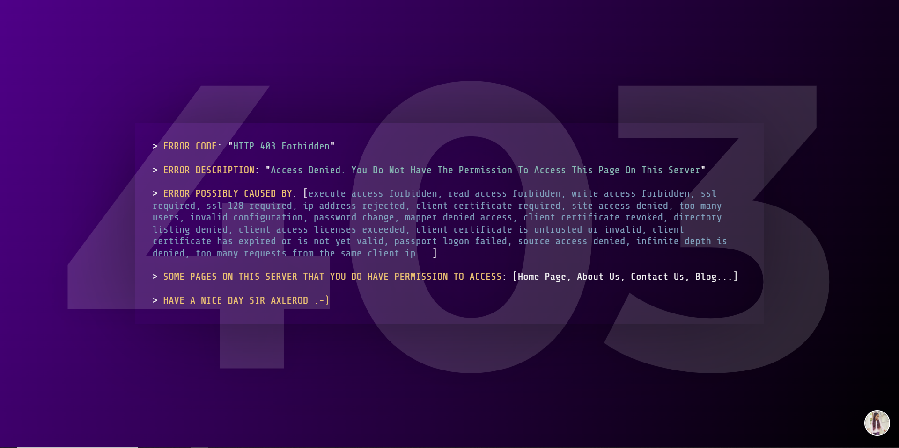
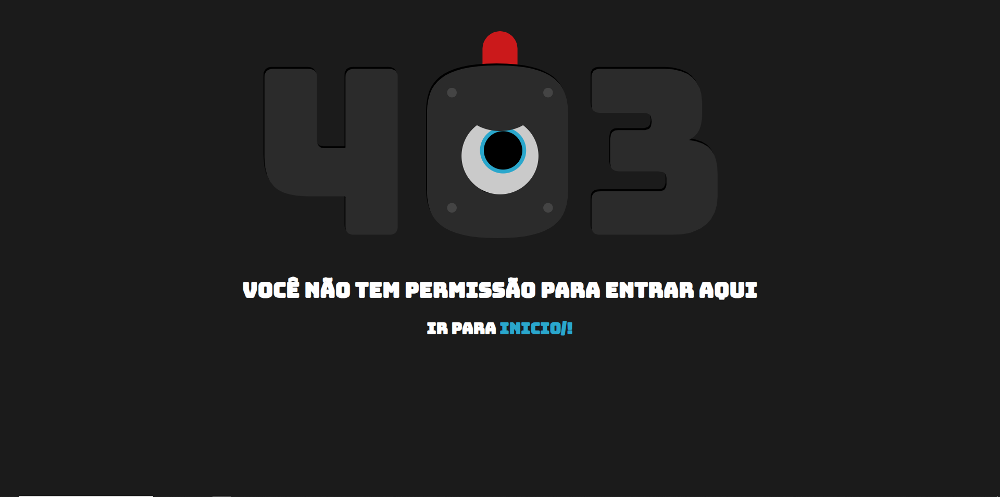

# Páginas de Erro 403 Personalizadas

Este projeto oferece uma coleção de páginas de erro 403 personalizadas e criativas, projetadas para melhorar a experiência do usuário quando eles encontram um erro de acesso negado em seu site. Cada design é único, incorporando diferentes estilos e mensagens para se adequar a uma variedade de sites.

## Visualizações

Aqui estão algumas visualizações das páginas de erro 403 incluídas neste projeto:

## Como Usar

Para usar essas páginas de erro em seu site, siga os passos abaixo:

1. Escolha a página de erro que melhor se adapta ao estilo do seu site.
2. Copie os arquivos HTML e CSS correspondentes para o seu servidor.
3. Configure seu servidor web para servir a página de erro personalizada quando um erro 403 for encontrado.

## Contribuindo

Contribuições são sempre bem-vindas! Se você tem uma ideia para uma nova página de erro 403 ou melhorias nas existentes, sinta-se à vontade para criar um pull request ou abrir uma issue.

## Licença

Este projeto é distribuído sob a licença MIT. Veja o arquivo `LICENSE` para mais detalhes.

Desenvolvido por [Lucio Motta](https://github.com/luciomotta).